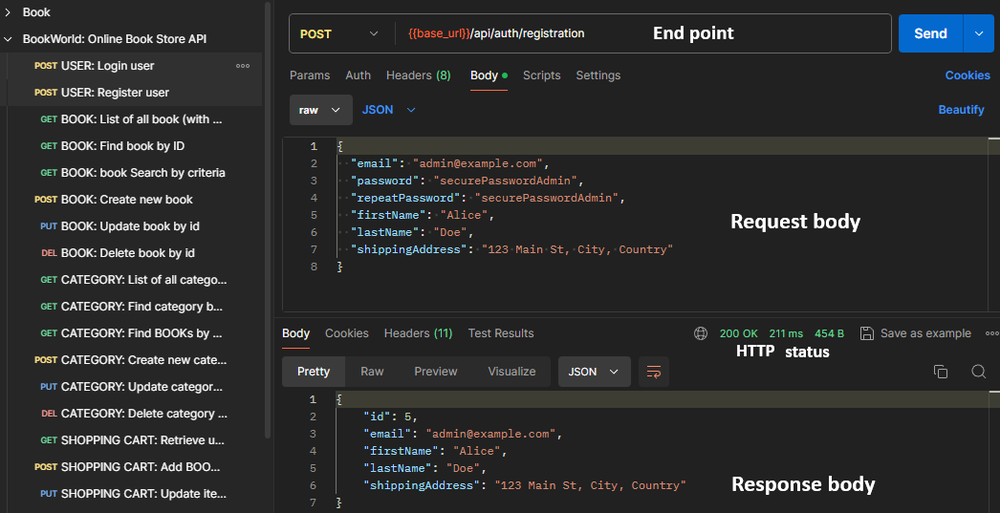
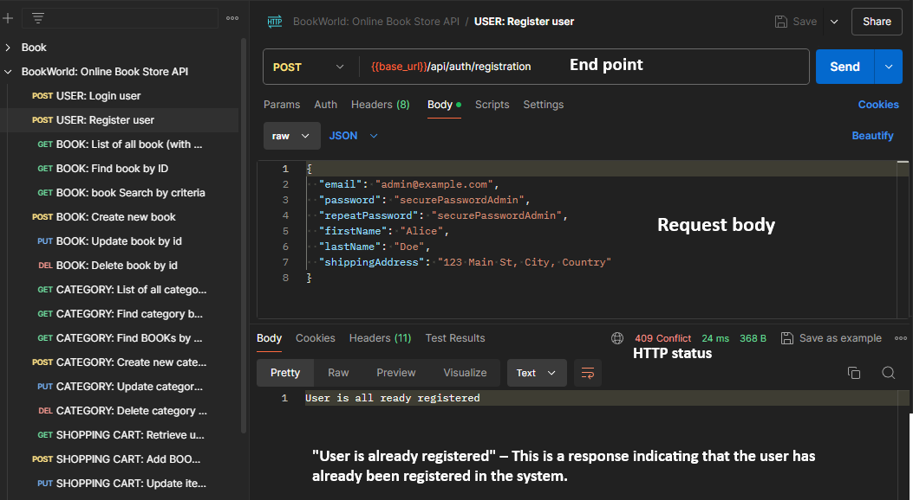
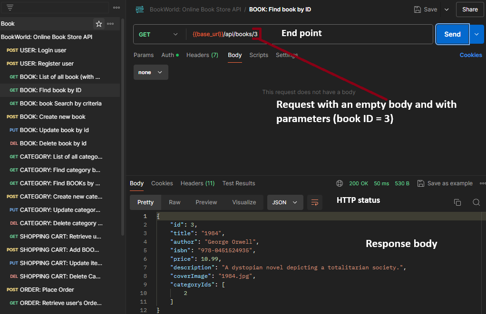
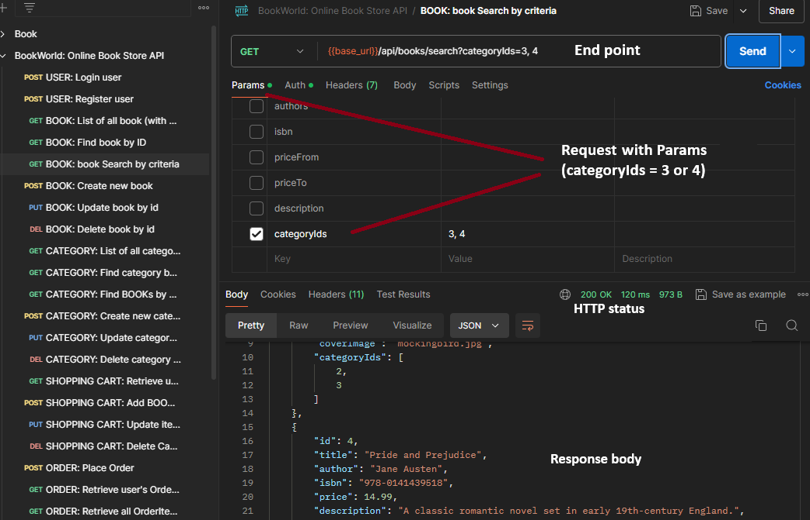
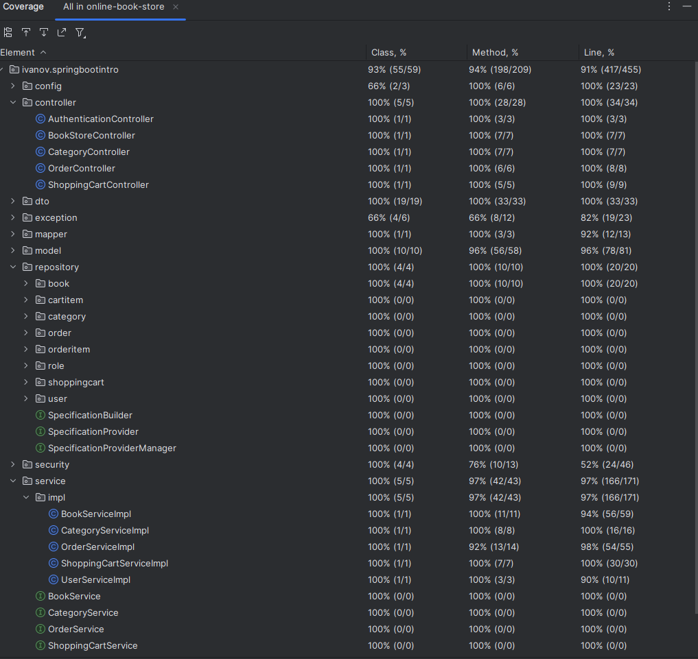

<h1 align="center" style="display: block; font-size: 2.5em; font-weight: bold; margin-block-start: 1em; margin-block-end: 1em;">
<picture>
          
</picture>
  <br /><br /><strong>BookWorld: Online Book Store</strong>
</h1>
<p align="center" style="text-decoration: none; font-size: 24px">
  Help & Feedback
  <br />
  <br />
  <a href="/.github/ISSUE_TEMPLATE/BUG_REPORT.md">Report a Bug</a>
  <>
  <a href="https://github.com/IvanovYurii/online-book-store/issues/new?assignees=&labels=enhancement&template=FEATURE_REQUEST.md&title=feat%3A+">Request a Feature</a>
  <>
  <a href="https://github.com/IvanovYurii/online-book-store/discussions">Ask a Question</a>
</p>

<p id="table-of-contents"></p>

---

<div style="font-size: 16px;">

## <picture></picture> Table of contents
- [Inspiration for the Project](#inspiration-for-the-project)
- [The problem that the Project solves](#the-problem-that-the-project-solves)
- [Advantages of the Project](#advantages-of-the-project)
- [Technologies used](#technologies-used)
- [Build and launch the Project](#build-and-launch-the-project)
  - [Use an AWS solution](#use-an-aws-solution)
  - [Build with `IDE` and `MySQL`](#build-with-ide-mysql)
  - [Build with `IDE` and `Docker`](#build-with-ide-docker)
  - [Build with `Docker` and `dockerHub`  images](#build-with-docker-dockerhub)
- [Entities](#entities)
  - [User](#user-entity)
  - [Role](#role-entity)
  - [Book](#book-entity)
  - [Category](#category-entity)
  - [ShoppingCart](#shopping-cart-entity)
  - [CartItem](#cart-item-entity)
  - [Order](#order-entity)
  - [OrderItem](#order-item-entity)
- [Database structure](#database-structure)
- [Endpoints](#end-points)
  - [Authentication Management](#user-end-point)
  - [Book Management](#book-end-point)
  - [Categories Management](#categories-end-point)
  - [Shopping Cart Management](#shopping-cart-end-point)
  - [Order Management](#order-end-point)
- [How to work with the application](#how-to-work-with-the-application)
  - [General provisions](#general-provisions)
  - [Working with **Swagger UI**](#working-with-swagger-ui)
  - [Working with **Postman**](#working-with-postman)
- [Tutorial Overview](#tutorial-overview)
- [Test Scenarios and Results](#test-scenarios-and-results)
- [License](#license)
- [Thank you all!](#thank-you-all)
</div>
<div id="inspiration-for-the-project" style="font-size: 16px;">

---

## <picture></picture> Inspiration for the Project
Creating a convenient and efficient way to purchase books in the online store was inspired by the desire to facilitate the process of choosing 
and purchasing books for users. The vision was to develop a platform that would allow users to easily search for books by various criteria, 
conveniently make purchases, and track their statuses. Against the background of the growing popularity of online shopping, especially in the 
context of the pandemic, it was important to provide an alternative to traditional bookstores and make the process of book purchases more 
convenient and accessible.
<div align="right">[ <a href="#table-of-contents">↑ Back to top ↑</a> ]</div>
</div>
<div id="the-problem-that-the-project-solves" style="font-size: 16px;">

---

## <picture></picture> The problem that the Project solves
The main problem that the project aims to solve is to create a convenient and simple way to purchase books in an online format. 
Traditional bookstores can be limited in selection and availability, while this project allows users to easily find and purchase books directly 
from their home computer or mobile device. In addition, the project solves the problem of the lack of a convenient tool for managing orders and 
shopping carts, which makes the shopping process more transparent and efficient for users.
<div align="right">[ <a href="#table-of-contents">↑ Back to top ↑</a> ]</div>
</div>
<div id="advantages-of-the-project" style="font-size: 16px;">

---

## <picture></picture> Advantages of the Project
* Convenience: Users can easily search for books and make purchases online without having to visit a physical store.
* Wide Selection: The platform offers a wide range of books by different authors and genres, meeting the needs of various readers.
* Convenient Order Management: Built-in services allow users to easily add books to the cart, place orders, and track their status.
* Efficiency and Accessibility: The project makes the process of purchasing books more efficient and accessible, reducing barriers to access to literary works.
* Integration with Other Applications: The application can be easily integrated with other websites or applications, expanding its functionality and user reach.
<div align="right">[ <a href="#table-of-contents">↑ Back to top ↑</a> ]</div>
</div>
<p id="technologies-used"></p>

---

<div style="font-size: 16px;">

## <picture></picture> Technologies used
* <picture></picture> Java 17+
* <picture></picture> Maven
* <picture></picture> Spring Boot
* <picture></picture> Spring Data JPA
* <picture></picture> Spring Boot Security
* <picture></picture> JSON Web Token
* <picture></picture> Lombok
* <picture></picture> MapStruct
* <picture></picture> Liquibase
* <picture></picture> MySql 8
* <picture></picture> Hibernate
* <picture></picture> JUnit5
* <picture></picture> Testcontainers
* <picture></picture> Docker
* <picture></picture> Swagger
* <picture></picture> Postman
<div align="right">[ <a href="#table-of-contents">↑ Back to top ↑</a> ]</div>
</div>
<p id="build-and-launch-the-project"></p>

---

<div style="font-size: 16px;">

## <picture></picture> Build and launch the Project
How to build the project and run it will be shown on the example of OS Windows 10 Pro. I apologize to all Linux and 
macOS users, I'm using what I have. In my example, I will use the project path <code>C:\Users\%USERNAME%\Project</code>
If you decide to put the project in a different folder, be careful and use your project path.

---

<div id="use-an-aws-solution"></div>
<h3>Use an <picture></picture> AWS solution</h3>
No installation or setup required; simply use the project without spending time on configuration and maintenance.

**Base_url for *Postman***
```
http://ec2-18-212-26-24.compute-1.amazonaws.com
```
***Swagger***
> <a href="http://ec2-18-212-26-24.compute-1.amazonaws.com/swagger-ui/index.html#/" target="_blank">http://ec2-18-212-26-24.compute-1.amazonaws.com/swagger-ui/index.html#/</a>

<div style="border: 1px solid red; padding: 10px; background-color: #f8d7da; color: #721c24;">
<strong>IMPORTANT:</strong>
How to work with the application is described in the section
<strong><a href="#how-to-work-with-the-application">How to work with the application</a></strong>.
</div>

---

<div id="build-with-ide-mysql"></div>
<h3>Build with <i>IDE</i> and <i>MySQL</i></h3>

In this setup, we will use a **local MySQL database**. This provides the advantage of ease of setup and full control over 
the database, but it may be limited in performance with a large volume of data.
<details><summary title="Click to show/hide details">Click to show/hide <strong>Build with <code>IDE</code> and <code>MySQL</code></strong>.</summary><br/>
Before you start, make sure you have installed:

* <picture></picture> **Java 17+**
* <picture></picture> **Maven** latest version
* <picture></picture> **MySql 8**
* <picture></picture> **IntelliJ IDEA Ultimate** (or another JDE)

**Step 1.**

Create a **MySQL database**. Write down or remember the following values:
* *MYSQLDB_URL*
* *port* for connecting to the database
* database *name*
* *user* name
* *user* password

In my example, I will use **MySQL Workbench 8.0 CE** to create a database

**Step 2.**

Load the project from the repository into the **IDE**. 
```sh
git@github.com:IvanovYurii/online-book-store.git
```
Wait for **maven** to download all dependencies, indexing the project files. Check the project settings and make sure **java 17** is selected.

**Step 3.**

Create an **.env** file in the root directory.

See an example of a sample **<code>.env-sample</code>**

**Step 4.**

Run the command in the **IDE** terminal.
```sh
mvn clean package -DskipTests
``` 

This command:

* **clean**: Removes all previously generated files and compilation results, allowing the build process to start from a clean state.
* **package**: Compiles the code and packages it into a JAR file.
* **-DskipTests**: skips tests.

After a successful run, you will see a similar message in the **Terminal window**:
```
[INFO] ------------------------------------------------------------------------
[INFO] BUILD SUCCESS
[INFO] ------------------------------------------------------------------------
[INFO] Total time:  02:08 min
[INFO] Finished at: 2024-08-05T13:11:52+03:00
[INFO] ------------------------------------------------------------------------
```
Of course, the time depends on the power of your PC.

**Step 5.**

Open the file **src/main/java/ivanov/springbootintro/SpringBootIntroApplication.java**. Run the file for execution. After a successful run, 
you will see a similar message in the **Run window**:
> Started SpringBootIntroApplication in 8.035 seconds (process running for 8.972). 

Of course, the time depends on the power of your PC.

**Step 6.**

Now, depending on which port you specified in **SPRING_LOCAL_PORT**, the program will run on that port (for example I use 8080 port)

**Base_url for *Postman***
```
http://localhost:8080
```

***Swagger***
> <a href="http://localhost:8080/swagger-ui/index.html#/" target="_blank">http://localhost:8080/swagger-ui/index.html#/</a>

<div style="border: 1px solid red; padding: 10px; background-color: #f8d7da; color: #721c24;">
<strong>IMPORTANT:</strong> 
We just launched the server. How to work with the application is described in the section 
<strong><a href="#how-to-work-with-the-application">How to work with the application</a></strong>.
</div>

<br>
<div align="center" style="font-size: xx-large">
<details><summary title="Click Here to View the Complete Video Tutorial">Click Here to View the Complete Video Tutorial</summary><br/>
          
[Build-with-IDE-and-MySQL](https://github.com/user-attachments/assets/0859093b-ea14-4980-8a31-728f1c7e4c50.webm)

[If the video does not play, click here](https://youtu.be/H7nktRBSQYw)

<div align="right">[ <a href="#table-of-contents">↑ Back to top ↑</a> ]</div>
</details>
</div>
</details>

---

<div id="build-with-ide-docker"></div>

<h3>Build with <i>IDE</i> and <i>Docker</i></h3>

In this setup, we will use a **MySQL database** running in **Docker**. This provides the advantage of easy deployment and scalability, 
and can potentially enhance performance due to optimized environment. However, performance may depend on container settings 
and host resources, and in some cases, it may impact execution speed.
<details><summary title="Click to show/hide details">Click to show/hide <strong>Build with <code>IDE</code> and <code>Docker</code></strong>.</summary><br/>
Before you start, make sure you have installed:

* <picture></picture> **Java 17+**
* <picture></picture> **Maven** latest version
* <picture></picture> **Docker** latest version
* <picture></picture> **IntelliJ IDEA Ultimate** (or another JDE)

**Step 1.**

Load the project from the repository into the **IDE**.
```sh
git@github.com:IvanovYurii/online-book-store.git
```
Wait for maven to download all dependencies, indexing the project files. Check the project settings and make sure **java 17** is selected.

**Step 2.**

Create an **.env** file in the root directory.

See an example of a sample **<code>.env-sample</code>**

**Step 3.**

Run the command in the **IDE terminal**.
```sh
mvn clean package -DskipTests
``` 

This command:

* **clean**: Removes all previously generated files and compilation results, allowing the build process to start from a clean state.
* **package**: Compiles the code and packages it into a JAR file.
* **-DskipTests**: skips tests.

We will use this **JAR** file to create a **Docker image**.

After a successful run, you will see a similar message in the **Terminal window**:
```
[INFO] ------------------------------------------------------------------------
[INFO] BUILD SUCCESS
[INFO] ------------------------------------------------------------------------
[INFO] Total time:  02:08 min
[INFO] Finished at: 2024-08-05T13:11:52+03:00
[INFO] ------------------------------------------------------------------------
```
Of course, the time depends on the power of your PC.

**Step 4.**

Start <picture></picture> **Docker**

**Step 5.**

Run the command in the **IDE terminal**.
```sh
docker-compose up --build
``` 

**Step 6.**

Now, depending on which port you specified in **SPRING_LOCAL_PORT**, the program will run on that port (for example I use 8081 port)

**Base_url for *Postman***
```
http://localhost:8081
```

***Swagger***
><a href="http://localhost:8081/swagger-ui/index.html#/" target="_blank">http://localhost:8081/swagger-ui/index.html#/</a>

<div style="border: 1px solid red; padding: 10px; background-color: #f8d7da; color: #721c24;">
<strong>IMPORTANT:</strong> 
We just launched the server. How to work with the application is described in the section 
<strong><a href="#how-to-work-with-the-application">How to work with the application</a></strong>.
</div>
<br>
<div align="center" style="font-size: x-large">
<details><summary title="Click Here to View the Complete Video Tutorial">Click Here to View the Complete Video Tutorial</summary><br/>

[Build with IDE and Docker](https://github.com/user-attachments/assets/5e4b482c-009c-4618-98a1-434a694bb5f6.mp4)

[If the video does not play, click here](https://youtu.be/wl7cgu-Hag4)

<div align="right">[ <a href="#table-of-contents">↑ Back to top ↑</a> ]</div>
</details>
</div>
</details>

---

<div id="build-with-docker-dockerhub"></div>

<h3>Build with <i>Docker</i> and <i>dockerHub images</i></h3>

In this setup, you're using **Docker** to run applications without needing to install **Java**, **Maven**, **MySQL**, or an **IDE**. 
You simply download ready-made images from **Docker Hub**, which reduces setup time and minimizes the risk of errors. 
This makes the process simpler and faster.
<details><summary title="Click to show/hide details">Click to show/hide <strong>Build with <code>Docker</code> and <code>dockerHub images</code></strong>.</summary><br/>
Before you start, make sure you have installed:

* <picture></picture> Docker latest version

Commands can be run in the terminal (for Windows, this can be **CMD, PowerShell,** or **Docker’s** terminal).

**Step 1.**

Start <picture></picture> Docker

**Step 2.**

Run the command in the terminal
```sh
docker network create my-network
``` 
This will create a new network named **my-network.**

**Step 3.**

Run the command in the terminal 
```sh
docker run --name mysql-db --network my-network -e MYSQL_ROOT_PASSWORD=12345678 -e MYSQL_DATABASE=book -p 3307:3306 -d mysql
``` 
This command starts a **MySQL** database in **Docker**. It sets up the database with the name mysql-db on the **my-network**
network, creates a **root password**, sets up a **database** called **book**, and makes it accessible on port **3307** on your computer.

**Step 4.**

Run the command in the terminal
```sh
docker run -p 8081:8080 --network my-network --name online-book-store-app -e SPRING_DATASOURCE_URL=jdbc:mysql://mysql-db:3306/book?serverTimeZone=UTC -e SPRING_DATASOURCE_USERNAME=root -e SPRING_DATASOURCE_PASSWORD=12345678 -e JWT_EXPIRATION=3000000 -e JWT_SECRET_STRING=online-book-store-ivanov.yuriitrsthrt6rujryyjethe5ye56yh6e5 ivanovyurii/online-book-store:latest
``` 
This command runs an **online book store** application, connects it to the **MySQL** database, configures **JWT** parameters, 
and exposes the application on **port 8081** of your computer.

**Step 5.**

Now the program will run on port 8081 port

**Base_url for *Postman***
```
http://localhost:8081
```

***Swagger***
> <a href="http://localhost:8081/swagger-ui/index.html#/" target="_blank">http://localhost:8081/swagger-ui/index.html#/</a>

<div style="border: 1px solid red; padding: 10px; background-color: #f8d7da; color: #721c24;">
<strong>IMPORTANT:</strong> 
We just launched the server. How to work with the application is described in the section 
<strong><a href="#how-to-work-with-the-application">How to work with the application</a></strong>.
</div>
<br>
<div align="center" style="font-size: x-large">
<details><summary title="Click Here to View the Complete Video Tutorial">Click Here to View the Complete Video Tutorial</summary><br/>

[Build with IDE and Docker](https://github.com/user-attachments/assets/2289e701-d39a-41b2-a87b-8b4551b1f468.mp4)

[If the video does not play, click here](https://youtu.be/B2G2bWrTPBo)

</details>
</div>
</details>

<div align="right">[ <a href="#table-of-contents">↑ Back to top ↑</a> ]</div>
</div>
<p id="entities" style="font-size: 16px;"></p>

---

<div style="font-size: 16px;">

## <picture></picture> Entities
<div id="user-entity"></div>

### <picture></picture> User
<details><summary title="Click to show/hide details">Click to show/hide <strong>User entity</strong>.</summary><br/>
<blockquote>
The user entity represents information about registered users who have their own shopping cart with which they can manipulate,
add and delete selected books and then proceed to the order processing stage.
</blockquote>
</details>
<div id="role-entity"></div>

### <picture></picture> Role
<details><summary title="Click to show/hide details">Click to show/hide <strong>Role entity</strong>.</summary><br/>
<blockquote>
The role determines the user's level of access to the system. Each user is assigned a specific role. There are currently
two types of roles: USER and ADMINISTRATOR. The USER can view and edit their own orders and selected books, create orders,
and the ADMINISTRATOR has the ability to add, delete and update data.
</blockquote>
</details>
<div id="book-entity"></div>

### <picture></picture> Book
<details><summary title="Click to show/hide details">Click to show/hide <strong>Book entity</strong>.</summary><br/>
<blockquote>
The purpose of the book is to provide a comprehensive description of the book available on the service.
</blockquote>
</details>
<div id="category-entity"></div>

### <picture></picture> Category
<details><summary title="Click to show/hide details">Click to show/hide <strong>Category entity</strong>.</summary><br/>
<blockquote>
The core of the category enables you to classify books into different groups and enhances their search-ability.
</blockquote>
</details>
<div id="shopping-cart-entity"></div>

### <picture></picture> ShoppingCart
<details><summary title="Click to show/hide details">Click to show/hide <strong>ShoppingCart entity</strong>.</summary><br/>
<blockquote>
The ShoppingCart for a user is a space where the books the user has selected for purchase are kept.
</blockquote>
</details>
<div id="cart-item-entity"></div>

### <picture></picture> CartItem
<details><summary title="Click to show/hide details">Click to show/hide <strong>CartItem entity</strong>.</summary><br/>
<blockquote>
A CartItem entity represents an individual item in the cart, containing specific information about a book.
</blockquote>
</details>
<div id="order-entity"></div>

### <picture></picture> Order
<details><summary title="Click to show/hide details">Click to show/hide <strong>Order entity</strong>.</summary><br/>
<blockquote>
The Order entity represents details about a user's order, including the time and delivery address, and contains the order items.
</blockquote>
</details>
<div id="order-item-entity"></div>

### <picture></picture> OrderItem
<details><summary title="Click to show/hide details">Click to show/hide <strong>OrderItem entity</strong>.</summary><br/>
<blockquote>
An OrderItem entity represents information about a book and is included within the order.
</blockquote>
</details>
<div align="right">[ <a href="#table-of-contents">↑ Back to top ↑</a> ]</div>
</div>

---

<div id="database-structure"></div>

## <picture></picture> Database structure
  

<div align="right">[ <a href="#table-of-contents">↑ Back to top ↑</a> ]</div>
<p id="end-points"></p>

---

<div style="font-size: 16px;">

## <picture></picture> Endpoints
<div id="user-end-point"></div>

### <picture></picture> Authentication Management
| HTTP Request | Endpoints          | Security requirement | Description                                          |
|--------------|:-------------------|:--------------------:|:-----------------------------------------------------|
| POST         | /api/auth/register |         User         | Register a new user to the system                    |
| POST         | /api/auth/login    |         User         | Login with email and password. Response - JWT token  |
<div id="book-end-point"></div>

### <picture></picture> Book Management
| HTTP Request | Endpoints          | Security requirement | Description                                                |
|--------------|:-------------------|:--------------------:|:-----------------------------------------------------------|
| GET          | /api/books         |         User         | Get all books per website pages                            |
| GET          | /api/books/{id}    |         User         | Get the book by its id number                              |
| GET          | /api/books/search  |         User         | Search books by any criteria                               |
| POST         | /api/books         |        Admin         | Create a new book                                          |
| PUT          | /api/books/{id}    |        Admin         | Update the book by its id number                           |
| DELETE       | /api/books/{id}    |        Admin         | Delete the book by its id number (soft-delete)             |
<div id="categories-end-point"></div>

### <picture></picture> Categories Management
| HTTP Request | Endpoints                  | Security requirement | Description                                        |
|--------------|:---------------------------|:--------------------:|:---------------------------------------------------|
| GET          | /api/categories            |         User         | Get all categories per website pages               |
| GET          | /api/categories/{id}       |         User         | Get the category by its id number                  |
| GET          | /api/categories/{id}/books |         User         | Get list of books by the category by its id number |
| POST         | /api/categories            |        Admin         | Create a new category                              |
| PUT          | /api/categories/{id}       |        Admin         | Update the category by its id number               |
| DELETE       | /api/categories/{id}       |        Admin         | Delete the category by its id number (soft-delete) |
<div id="shopping-cart-end-point"></div>

### <picture></picture> Shopping Cart Management
| HTTP Request | Endpoints                 | Security requirement | Description                                                    |
|--------------|:--------------------------|:--------------------:|:---------------------------------------------------------------|
| GET          | /api/cart                 |         User         | Get shopping cart                                              |
| POST         | /api/cart                 |         User         | Add a new book to the shopping cart                            |
| PUT          | /api/cart/cart-items/{id} |         User         | Endpoint for updating quantity of an item in the shopping cart |
| DELETE       | /api/cart/cart-items/{id} |         User         | Delete a book from the shopping cart by id                     |
<div id="order-end-point"></div>

### <picture></picture> Order Management
| HTTP Request | Endpoints                       | Security requirement | Description                                                                      |
|--------------|:--------------------------------|:--------------------:|:---------------------------------------------------------------------------------|
| POST         | /api/orders                     |         User         | Place an order based on your shopping cart, after which the cart will be emptied |
| GET          | /api/orders                     |         User         | Get all orders for the user                                                      |
| GET          | /api/orders/{id}/items          |         User         | Get all order items by order id                                                  |
| GET          | /api/orders/{id}/items/{itemId} |         User         | Get info about the order item by order id and item id                            |
| PATCH        | /api/orders/{id}                |        Admin         | Update order status for order by id                                              |
<div align="right">[ <a href="#table-of-contents">↑ Back to top ↑</a> ]</div>
</div>

---
<p id="how-to-work-with-the-application"></p>
<br style="font-size: 16px;">

## <picture></picture> How to work with the application
<div id="general-provisions"></div>
<h3>General provisions</h3>

<div style="border: 1px solid red; padding: 10px; background-color: #f8d7da; color: #721c24;">
<strong>IMPORTANT:</strong> 
Before using the application, <strong><a href="#build-and-launch-the-project">start the server</a></strong>.
</div>

Access Credentials for **Admin** and **User**

<table>
  <tr>
    <th colspan="2">Admin</th>
    <th colspan="2">User</th>
  </tr>
  <tr>
    <th>Login</th>
    <th>Password</th>
    <th>Login</th>
    <th>Password</th>
  </tr>
  <tr>
    <td>

```
bob.jones@example.com
```
</td>
    <td>

```
bobspassword
```
</td>
    <td>

```
john.doe@example.com
```
</td>
    <td>

```
password123
```
</td>
  </tr>
</table>

<details><summary title="Click to show/hide details">Click to show/hide <strong>General provisions</strong>
</summary><br/>

Let's explore how our application handles different types of **HTTP requests: GET, PUT, POST, PATCH,** 
and **DELETE** for interacting with the **API**.

**Requests** can be:

* **Empty**: When no data or parameters need to be transmitted.
* With **Parameters**: Including required and optional parameters, which can be passed through the URL or as part of the request.
* With a **Request Body** in **JSON Format**: Some requests, especially **PUT** and **POST**, require sending data in 
**the request body in JSON format**.

Regarding server responses, they typically include:

* **Request Status**: An **HTTP status code** indicating the result of the request (e.g., **200 for a successful request**
or **404 for a not found resource**).
* **Error Message**: If an error occurs, the server may send a description of the problem to help understand the cause of the failure.
* **JSON-formatted Text**: Data returned by the server in response is usually in **JSON format**, which provides a convenient 
way to exchange information between the client and the server.

We will provide a detailed demonstration of how to work with these requests and interpret server responses in our application.

**Important**: for a **successful delete operation**, the response body will be **empty** and the status code will be 204 (**No Content**).
This status code indicates that the **request was successful**, but there is no content to return in the response.

<div align="right">[ <a href="#table-of-contents">↑ Back to top ↑</a> ]</div>
</details>

<details><summary title="Click to show/hide details">Click to show/hide <strong>screenshots</strong> for <strong>JSON-formatted Text</strong>
to <strong>send</strong> and <strong>receive</strong> responses.</summary><br/>









<div align="right">[ <a href="#table-of-contents">↑ Back to top ↑</a> ]</div>
</details>

<div id="working-with-swagger-ui"></div>

<h3>Working with <picture></picture> <i>Swagger UI</i></h3>

**Open *Swagger UI***:

Navigate to http://localhost:port/swagger-ui/index.html#/ (or the equivalent AWS URL) to interact with the API documentation and test endpoints.

For example, the application is launched on port **8080**

> http://localhost:8080/swagger-ui/index.html#/

Use **Admin** or **User** data for authorization. After authorization, you can test the application.

<div align="center" style="font-size: x-large">
          
[Click here for a tutorial video](https://youtu.be/ln06psfr2xs)

</div>

<div id="working-with-postman"></div>

<h3>Working with <picture></picture> <i>Postman</i></h3>

**Step 1.**
<p>To download the <b>Postman Collection JSON</b> file, visit the following link and click the "Download" button:</p>
<a href="https://github.com/IvanovYurii/online-book-store/blob/Spring-boot-Add-README.md/BookWorld-Online-Book-Store-API.postman_collection.json" 
target="_blank">View Postman Collection JSON on GitHub</a>
<br>
<br>

**Step 2.**

Import the collection

**Step 3.**

Use **Admin** or **User** data for authorization. ***Postman*** is configured to use a **bearer token** to 
access endpoints. After authorization, you receive a response **token**. Configure the collection: **base_url** 
and **token**. ***Save the settings***. Now you can test the application.

<div align="center" style="font-size: x-large">

[Click here for a tutorial video](https://youtu.be/olRkALT70BM)

<div align="right">[ <a href="#table-of-contents">↑ Back to top ↑</a> ]</div>

</div>

---

<p id="tutorial-overview"></p>

## <picture></picture> Tutorial Overview

<div align="center" style="font-size: x-large">
          
[Click Here to View the Complete Video Tutorial](https://www.youtube.com/playlist?list=PL-c-Y80JbWOfpfuNQY25Z-YzreKt9iVY1)

</div>

---

<p id="test-scenarios-and-results"></p>
<div style="font-size: 16px;">

## <picture></picture> Test Scenarios and Results

***The project includes:***

* **Unit Tests**
* **Integration Tests**
* **System Tests**

*Testing Screenshot:*


<div align="right">[ <a href="#table-of-contents">↑ Back to top ↑</a> ]</div>
</div>

---

## License
<div style="font-size: 16px;">

This project is licensed under the **MIT license**. Feel free to edit and distribute this template as you like.

See [LICENSE](LICENSE.txt) for more information.
<div align="right">[ <a href="#table-of-contents">↑ Back to top ↑</a> ]</div>
</div>

---

## Thank you all!
<div id="inspiration-for-the-project" style="font-size: 16px;">
Thanks to all contributors and supporters who added stars to this repository, to everyone who supports the project.

A special thanks to my **teachers** and **mentors**. Their knowledge and guidance were instrumental in helping me create this project. :)
<br>
<br>

[](https://github.com/Ivan95kos) 
[](https://github.com/olekskov)
[](https://github.com/okuzan)
[](https://github.com/kozhukhovsky)
[](https://github.com/Sanderfuck)
[](https://github.com/Elena-Bruyako)
[](https://github.com/sarakhmen)

<div align="right">[ <a href="#table-of-contents">↑ Back to top ↑</a> ]</div>
</div>

---
