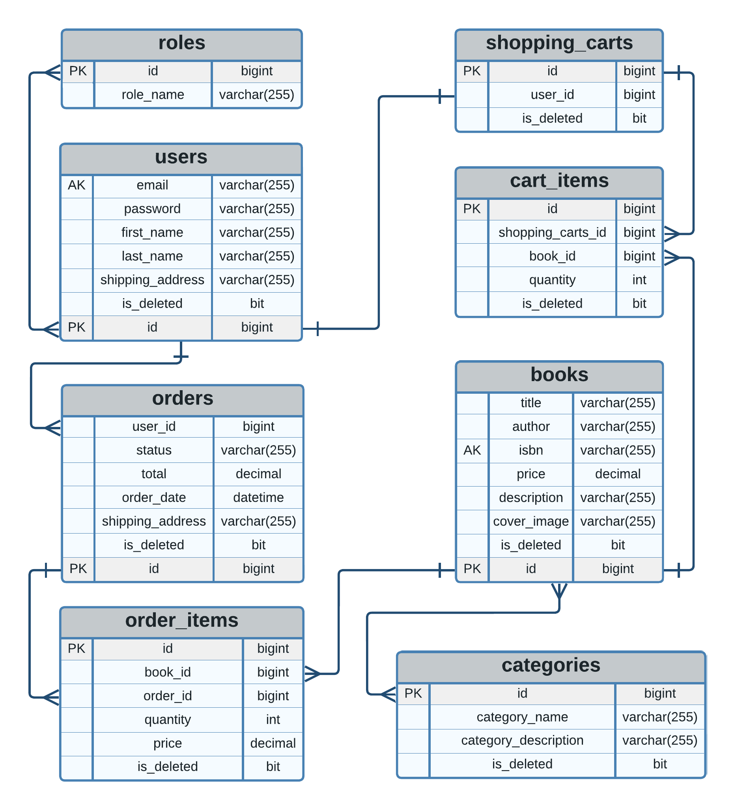

<h1 align="center" style="display: block; font-size: 2.5em; font-weight: bold; margin-block-start: 1em; margin-block-end: 1em;">
<picture>
          
</picture>
    <strong>BookWorld: Online Book Store</strong>
</h1>

  Help & Feedback
   
   
  <a href="https://github.com/IvanovYurii/online-book-store/issues/new?assignees=&labels=bug&template=01_BUG_REPORT.md&title=bug%3A+">Report a Bug</a>
  ·
  <a href="https://github.com/IvanovYurii/online-book-store/issues/new?assignees=&labels=enhancement&template=FEATURE_REQUEST.md&title=feat%3A+">Request a Feature</a>
  .
  <a href="https://github.com/IvanovYurii/online-book-store/discussions">Ask a Question</a>

---

<h2 style="display: inline; vertical-align: middle;">Table of contents</h2>

- [Inspiration for the Project](#inspiration-for-the-project)
- [The problem that the Project solves](#the-problem-that-the-project-solves)
- [Advantages of the Project](#advantages-of-the-project)
- [Technologies used](#technologies-used)
- [Clone sources](#clone-sources)
- [Build and launch the Project](#build-and-launch-the-project)
  - [Build with `cmake`](#build-with-cmake)
  - [Build with `msbuild`](#build-with-msbuild)
  - [Build with WSL](#build-with-wsl)
  - [Build with IDEs](#build-with-ides)
    - [Build with Microsoft Visual Studio](#build-with-microsoft-visual-studio)
    - [Build with Visual Studio Code](#build-with-visual-studio-code)
- [Integration](#integration)
  - [Start a Project](#start-a-project)
  - [Create Services](#create-services)
  - [Configure Multicast Router](#configure-multicast-router)
  - [Configure Logging](#configure-logging)
- [Database structure](#database-structure)
- [Use cases and benefits](#use-cases-and-benefits)
- [Examples](#examples)
- [License](#license)
- [Call to action](#call-to-action)
- [Thank you all!](#thank-you-all)

---

<picture id="inspiration-for-the-project">
    
</picture>
<h2 style="display: inline; vertical-align: middle;">Inspiration for the Project</h2>

Creating a convenient and efficient way to purchase books in the online store was inspired by the desire to facilitate the process of choosing 
and purchasing books for users. The vision was to develop a platform that would allow users to easily search for books by various criteria, 
conveniently make purchases, and track their statuses. Against the background of the growing popularity of online shopping, especially in the 
context of the pandemic, it was important to provide an alternative to traditional bookstores and make the process of book purchases more 
convenient and accessible.

[ <a href="#table-of-contents">↑ Back to top ↑</a> ]

---

<picture>
  
</picture>
<h2 id="the-problem-that-the-project-solves" style="display: inline; vertical-align: middle; margin: 0;">The problem that the Project solves</h2>

The main problem that the project aims to solve is to create a convenient and simple way to purchase books in an online format. 
Traditional bookstores can be limited in selection and availability, while this project allows users to easily find and purchase books directly 
from their home computer or mobile device. In addition, the project solves the problem of the lack of a convenient tool for managing orders and 
shopping carts, which makes the shopping process more transparent and efficient for users.

[ <a href="#table-of-contents">↑ Back to top ↑</a> ]

---

<picture style="display: inline-block; vertical-align: middle;">
  
</picture>
<h2 id="advantages-of-the-project" style="display: inline; vertical-align: middle; margin: 0;">Advantages of the Project</h2>

* Convenience: Users can easily search for books and make purchases online without having to visit a physical store.
* Wide Selection: The platform offers a wide range of books by different authors and genres, meeting the needs of various readers.
* Convenient Order Management: Built-in services allow users to easily add books to the cart, place orders, and track their status.
* Efficiency and Accessibility: The project makes the process of purchasing books more efficient and accessible, reducing barriers to access to literary works.
* Integration with Other Applications: The application can be easily integrated with other websites or applications, expanding its functionality and user reach.

[ <a href="#table-of-contents">↑ Back to top ↑</a> ]

---

<picture style="display: inline-block; vertical-align: middle;">
  
</picture>
<h1 style="margin: 0; padding: 0; height: 60px; visibility: hidden;">&nbsp;</h1> <!-- Невидимий заголовок для простору -->
<h2 id="technologies-used" style="display: inline; vertical-align: middle; margin: 0;">Technologies used</h2>

* <picture></picture> Java 17+
* <picture></picture> Maven
* <picture></picture> Spring Boot
* <picture></picture> Spring Data JPA
* <picture></picture> Spring Boot Security
* <picture></picture> JSON Web Token
* <picture></picture> Lombok
* <picture></picture> MapStruct
* <picture></picture> Liquibase
* <picture></picture> MySql 8
* <picture></picture> Hibernate
* <picture></picture> JUnit5
* <picture></picture> Testcontainers
* <picture></picture> Docker
* <picture></picture> Swagger

[ <a href="#table-of-contents">↑ Back to top ↑</a> ]

---

<picture style="display: inline-block; vertical-align: middle;">
  
</picture>
<h2 id="clone-sources" style="display: inline; vertical-align: middle; margin: 0;">Clone sources</h2>

[ <a href="#table-of-contents">↑ Back to top ↑</a> ]

---

<picture style="display: inline-block; vertical-align: middle;">
  
</picture>
<h2 id="build-and-launch-the-project" style="display: inline; vertical-align: middle; margin: 0;">Build and launch the Project</h2>

[ <a href="#table-of-contents">↑ Back to top ↑</a> ]

---

<picture style="display: inline-block; vertical-align: middle;">
  
</picture>
<h2 id="database-structure" style="display: inline; vertical-align: middle; margin: 0;">Database structure</h2>
  
<picture></picture>

[ <a href="#table-of-contents">↑ Back to top ↑</a> ]

---

  
Click to show/hide video: clone Project in IntelliJ IDEA Ultimate

  [Clone Project in IntelliJ IDEA Ultimate](https://github.com/user-attachments/assets/75445a6d-c10e-4fb6-9254-3be1fcaf3e5f)

